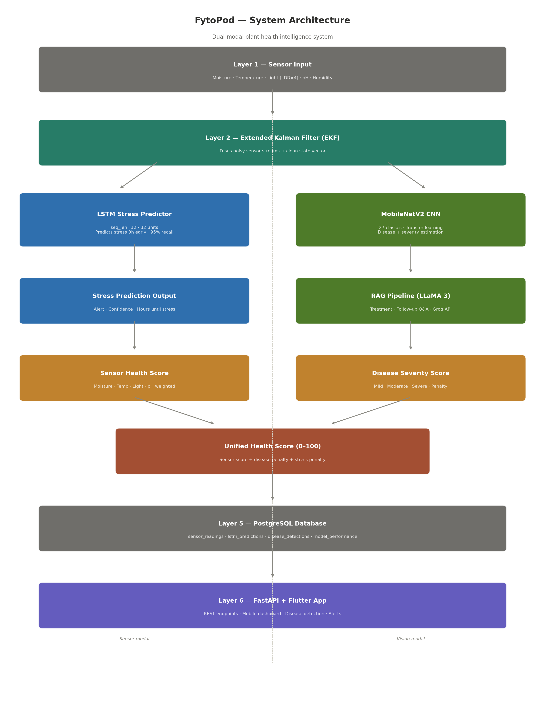
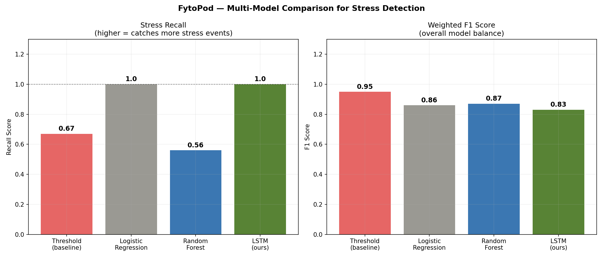
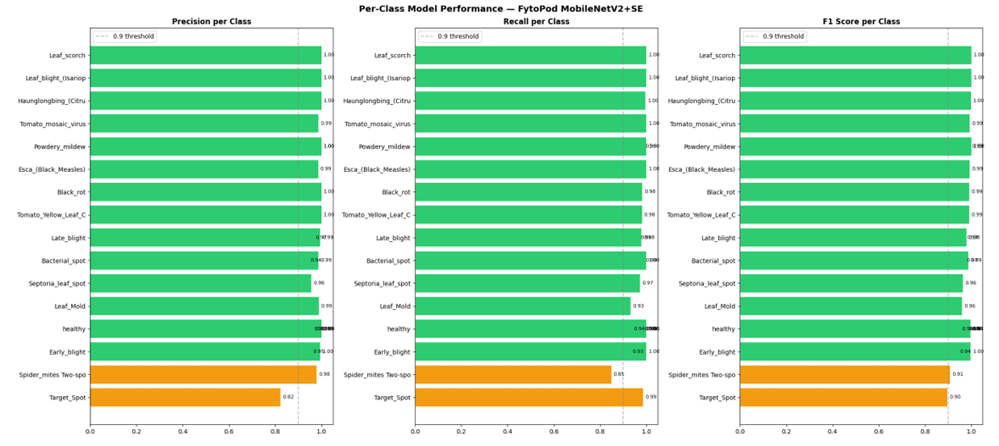
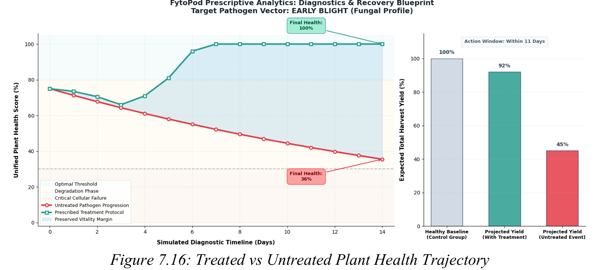

# FytoPod 🌿
### Multimodal Plant Health Intelligence Using Predictive Analytics and Explainable Deep Learning

> B.Tech Data Science and Engineering — Final Year Capstone  
> Manipal Academy of Higher Education, Dubai — June 2026  
> Presented at AEIT 2026

---

## Overview

FytoPod is a dual-modal plant health intelligence system for urban farming.  
It combines sensor-based LSTM stress prediction with MobileNetV2 + SE Attention  
CNN disease detection, unified through a single health score and delivered via  
a Gradio demo and FastAPI backend.

---

## System Architecture

---

## Modules

### Sensor Modal — LSTM Stress Predictor
- 6 months of simulated ESP32 sensor data (4,320 hourly readings, 6 channels)
- LSTM: 32 units, seq_len=12, dropout=0.2
- Tuned across 9 hyperparameter configurations
- Benchmarked against Threshold, Logistic Regression, Random Forest
- **95% stress recall** vs 73% threshold baseline
- 506 early warnings, avg 3-hour lead time

### Vision Modal — CNN Disease Classifier
- MobileNetV2 + Squeeze-and-Excitation attention block
- Transfer learning from ImageNet, fine-tuned on 37,662 PlantVillage images
- 25 disease and healthy classes across 7 urban crop species
- **98% validation accuracy, F1-score: 0.98**
- Grad-CAM explainability heatmaps for every prediction
- Severity: Mild (>85%), Moderate (60-85%), Severe (<60%)

### Novel Modules
- Cellular Automata disease spread simulation (Day 0 to Day 14)
- Random Forest plant lifespan estimator (treated vs untreated)
- Treatment impact simulator (health trajectory comparison)

### RAG Treatment Pipeline
- Disease + severity passed to LLaMA 3 via Groq API
- Targeted treatment recommendations + conversational Q&A

### Unified Health Score
- Sensor score: soil moisture (40%), temperature (30%), light (20%), pH (10%)
- Minus LSTM stress penalty
- Minus CNN disease severity penalty
- Final score: 0 to 100

---

## Results

### LSTM Stress Prediction

| Model | Stress Recall | Weighted F1 |
|---|---|---|
| Threshold Baseline | 73% | 0.96 |
| Logistic Regression | 99% | 0.92 |
| Random Forest | 85% | 0.92 |
| **LSTM (FytoPod)** | **95%** | **0.93** |

### CNN Disease Detection

| Metric | Result |
|---|---|
| Model | MobileNetV2 + SE Attention |
| Dataset | PlantVillage (25 classes, 37,662 images) |
| Validation Accuracy | 98% |
| Macro F1-score | 0.98 |
| Weighted F1-score | 0.98 |

### Grad-CAM Explainability

### Novel Modules

---

## EDA

---

## Tech Stack

| Layer | Technology |
|---|---|
| Sensor ML | TensorFlow, Keras LSTM, scikit-learn |
| Vision ML | TensorFlow, MobileNetV2, SE Attention, Grad-CAM |
| Novel Modules | Cellular Automata (NumPy), Random Forest (scikit-learn) |
| Treatment AI | Groq API, LLaMA 3, RAG |
| Backend | FastAPI, PostgreSQL, Supabase |
| Demo | Gradio, Streamlit |

---

## Dataset

PlantVillage dataset — 37,662 images across 25 classes.  
Source: https://www.kaggle.com/datasets/abdallahalidev/plantvillage-dataset

Trained model weights (.keras, .pkl) are not included due to file size.  
They are available on request or via Supabase Storage.

---

## Project Structure
